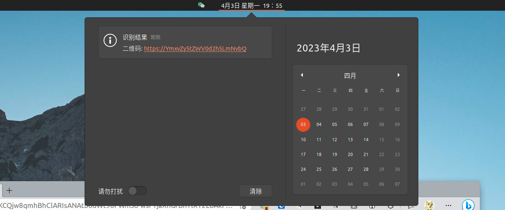

# Scann

一个 linux 上面快速截图和识图工具

启动之后可进行截图，并自动识别二维码或条形码

识别结果自动写入剪贴板

目前版本支持识别以下图形

- qrcode 二维码
- barcode 条形码

todo
- ocr ?
- 智能搜索 ？
- 二维码、条形码生成 ？

可搭配 [fastray](https://github.com/Ericwyn/fastray) 项目来实现 appTray 处快捷启动




## 项目依赖
项目在 ubuntu 20.04 下开发和测试，依赖以下命令
- `gnome-screenshot` : 用以截图
- `xclip` : 用以设置和获取剪贴板内容
- `notify-send` : 用以发送通知

## 使用
```shell
ericwyn@GodzillaPad:~/dev/go/scann$ go build scann.go

ericwyn@GodzillaPad:~/dev/go/scann$ ./scann -h
Usage of ./scann:
  -bar
        bar code scan
  -qr
        qr code scan

ericwyn@GodzillaPad:~/dev/go/scann$ ./scann 
[03-31 17:39:25] [I] not set -bar or -qr, will scan both bar code and qr code
[03-31 17:39:28] [I] filePath: /tmp/go-scann-screenshot-temp.png screenShotResult: true
[03-31 17:39:28] [E] AnalysisBarCodePng Decode error: NotFoundException ,path: /tmp/go-scann-screenshot-temp.png
[03-31 17:39:28] [E] AnalysisBarCodePng error: NotFoundException
[03-31 17:39:28] [I] qrcode analysisResult: YmxvZy5tZWV0d2h5LmNvbQ==
[03-31 17:39:28] [I] set clip text: YmxvZy5tZWV0d2h5LmNvbQ==

ericwyn@GodzillaPad:~/dev/go/scann$ 

```